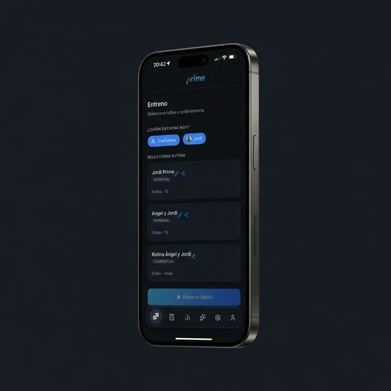
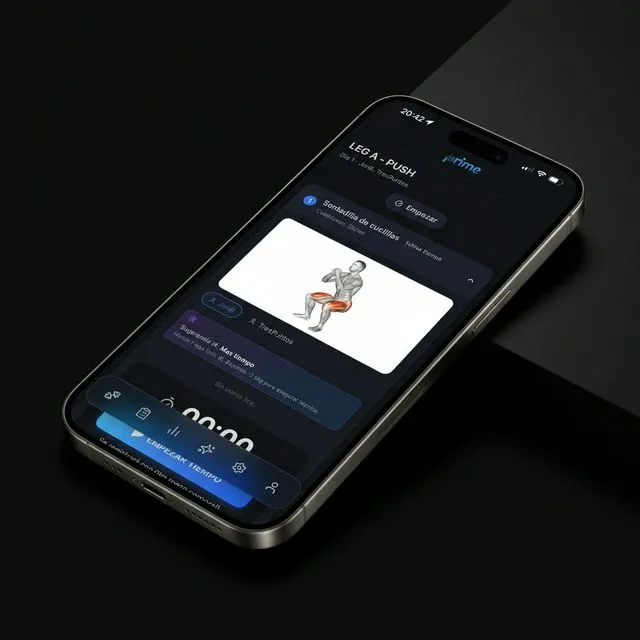
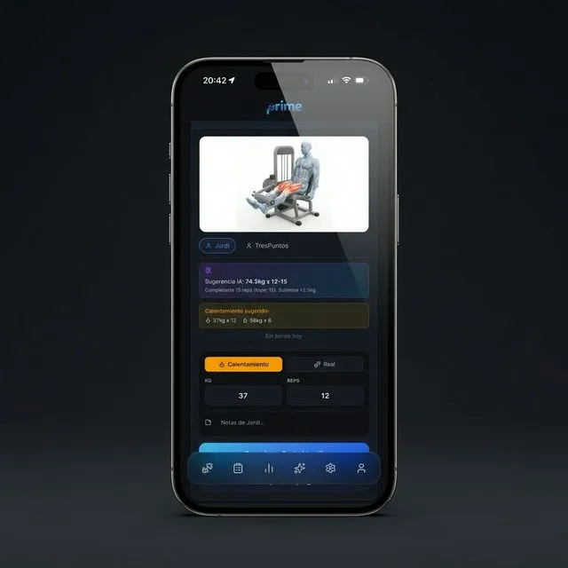

# Gym Tracker App - Case Study

## 1. Introduction
**Gym Tracker App** is a progressive web application (PWA) designed for advanced workout tracking. It addresses a specific niche: training partners ("gym bros") who share a single device during their sessions. The project aims to deliver a **premium**, fluid, and efficient experience, eliminating the friction of logging weights and repetitions while providing clear progress statistics.

## 2. Problem Statement
Traditional workout apps often assume a single user per device, making it cumbersome for partners to switch contexts or log sets alternately. Additionally, many apps suffer from cluttered interfaces or friction-heavy logging processes that disrupt the flow of a workout. The challenge was to create a "zero-friction" interface that accommodates multi-user sessions significantly better than existing solutions, wrapped in a high-end aesthetic.

## 3. Research and Discovery
The core functionality revolves around the **Shared Device / Multi-User** capability.
*   **User Needs**: Users need to swap active profiles instantly to log sets without navigating through complex menus.
*   **Key Features Identified**:
    *   **Smart Progression**: Automated "Overload" logic that suggests weights based on previous performance (RIR, failure).
    *   **Role Management**: Distinct User and Admin roles for managing the exercise database.
    *   **AI Integration**: Future plans for an AI assistant to analyze user statistics.

## 4. Design Process
The design philosophy is **"Dark Premium Apple Blue"**, inspired by the polished aesthetics of Apple Health and Fitness.

### Visual Identity
*   **Color Palette**:
    *   **Background**: `#0F1115` (Deep, elegant black).
    *   **Surfaces**: `#161A22` (Cards) and `#1C2230` (Interactive elements).
    *   **Primary Accent**: `#3B82F6` (Apple Blue).
    *   **Status Colors**: `#30D158` (Success/Green) and `#FF453A` (Failure/Red).
*   **Typography**: Utilizing system fonts (`-apple-system`, `San Francisco`, `Inter`) for native legibility.
*   **UI Components**:
    *   Rounded cards (`14px` - `20px`).
    *   Touch-friendly buttons (min-height `44px`).
    *   No dependency on heavy UI frameworks; custom CSS implementation for total control.

## 5. Implementation
The application is built for maximum performance and scalability.

### Technical Stack
*   **Frontend**: React 19 + Vite + TypeScript.
*   **Routing**: React Router 7.
*   **State/Cache**: Dexie.js (IndexedDB) for robust offline support.
*   **Backend**: Supabase (PostgreSQL, Auth, Storage).

### Architecture
*   **Database**: Relational schema handling Users, Exercises, Routines, and Logs.
*   **Logic**: "Overload" system that intelligently adjusts weight suggestions based on success (target reps met) or failure.

## 6. Visuals & Mockups
Below are the key interfaces of the application, showcasing the "Dark Premium" aesthetic.

## 7. Demo
<video src="gym_demo.mp4" controls width="100%" style="border-radius: 12px; box-shadow: 0 4px 12px rgba(0,0,0,0.5);"></video>

## 8. Conclusion
Gym Tracker App bridges the gap between casual logging and professional training tools. By focusing on the specific use case of shared-device training and enforcing a strict, premium design system, it offers a superior user experience. The scalable architecture ensures it can grow from a personal tool to a widely used PWA.
